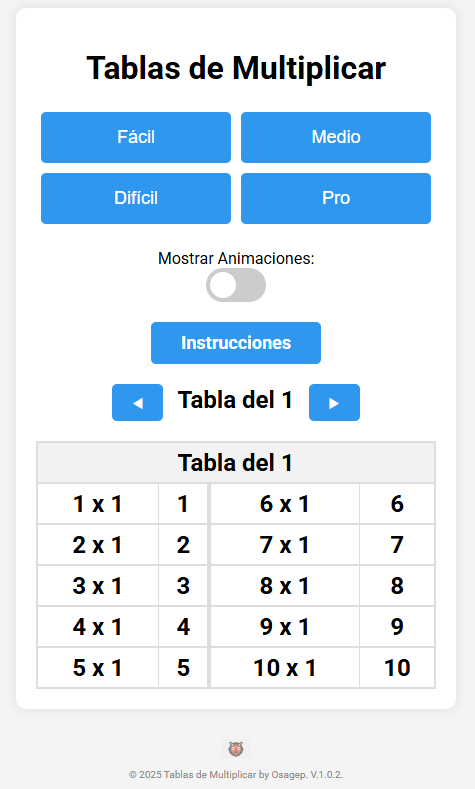

# 🎮 Juego de Tablas de Multiplicar en PHP

[

## 📚 Descripción
Juego educativo interactivo para practicar las tablas de multiplicar, ideal para niños. Genera preguntas aleatorias, valida respuestas y muestra puntuación.

## 🛠️ Cómo está construido
### 🔧 Tecnologías
| Componente | Tecnología |
|------------|------------|
| Backend    | PHP 7+     |
| Frontend   | HTML5, CSS3, JavaScript |
| Estructura | Arquitectura monolítica |

### 🧠 Lógica Principal
```php
<?php
// Genera pregunta aleatoria
$num1 = rand(1, 10);
$num2 = rand(1, 10);
$_SESSION['respuesta_correcta'] = $num1 * $num2;

// Valida respuesta
if ($_POST['respuesta'] == $_SESSION['respuesta_correcta']) {
    $_SESSION['puntuacion']++;
}
?>
🎨 Interfaz
Diseño responsive (funciona en móviles y tablets)

Feedback visual (colores para aciertos/errores)

Animaciones CSS para mejor experiencia

🚀 Cómo ejecutarlo
🔧 Requisitos
Servidor web (XAMPP, WAMP, etc.)

PHP 7.0+

Navegador moderno

⚙️ Instalación
bash
git clone https://github.com/OsageP/Juego-en-php-tablas-multiplicar.git
cd Juego-en-php-tablas-multiplicar
mv juego /var/www/html/  # Para XAMPP

📌 Características clave
✔️ Generación aleatoria de preguntas
✔️ Sistema de puntuación con sesiones PHP
✔️ Validación en tiempo real con JavaScript
✔️ Diseño amigable para niños

📂 Estructura de archivos
/juego/
├── index.php        # Página principal
├── style.css       # Estilos
├── script.js       # Lógica frontend
└── img/            # Assets visuales
🛠️ Roadmap
Añadir temporizador

Implementar niveles de dificultad

Guardar records en local en archivos txt

👨‍💻 Autor
OsageP - ¡Contribuciones son bienvenidas!

📄 Licencia
MIT © 2023 - Libre para uso educativo
